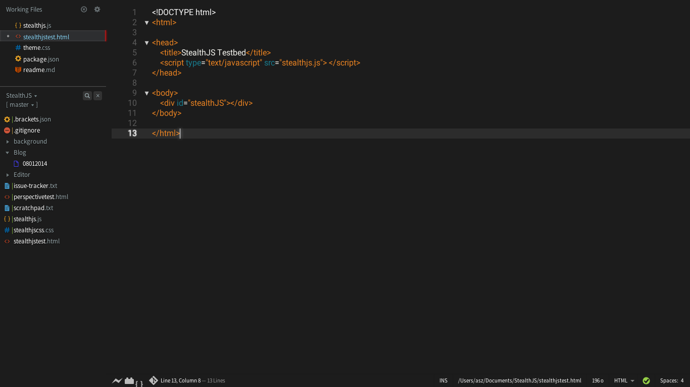
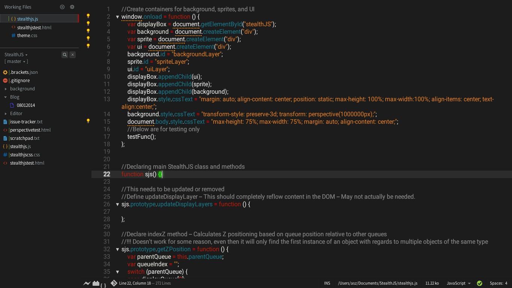

Midnight Glow Theme for Brackets
===

Screenshots
---

### HTML


### CSS


### JavaScript


Notes
---
Please note that the screenshots show the overall UI themed (including the sidebar and such) but this is not currently possible with standard bracket theming so it is not enabled by default. The CSS for the UI theme is included in the main ```theme.css``` file, but is only able to be used by other extensions that enable such functionality.

08/14/14 -- Removed UITheme.css file, included instead in theme.css file. Changed working file selection UI theme to be less bad.

License
---

The MIT License. Read [LICENSE](LICENSE) for further information.